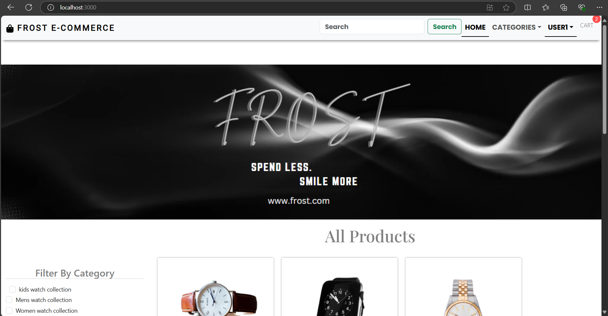
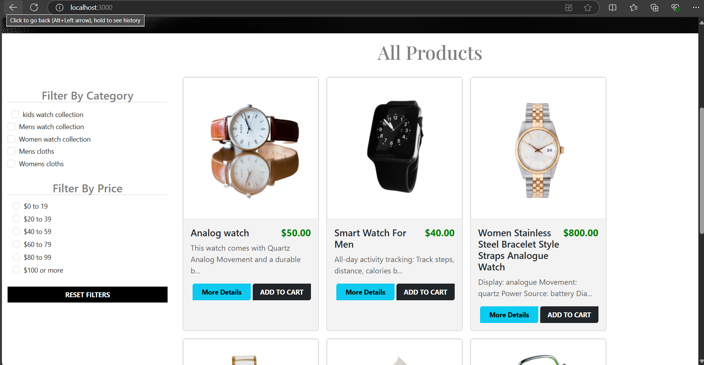
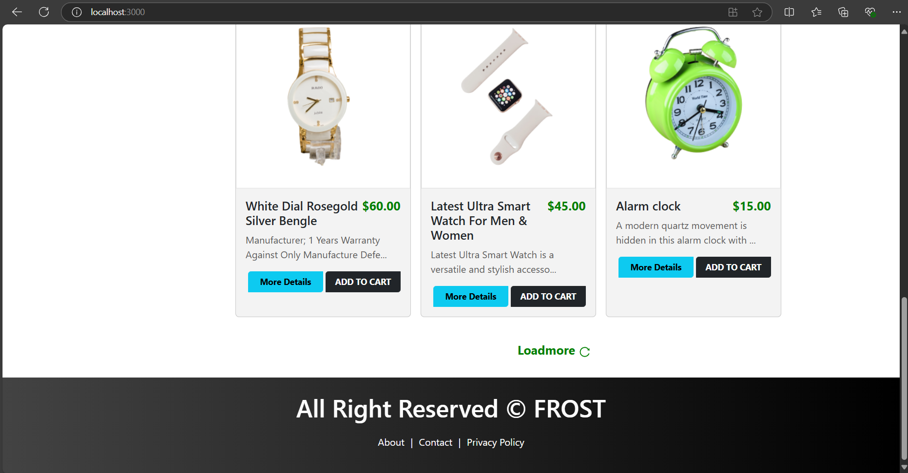
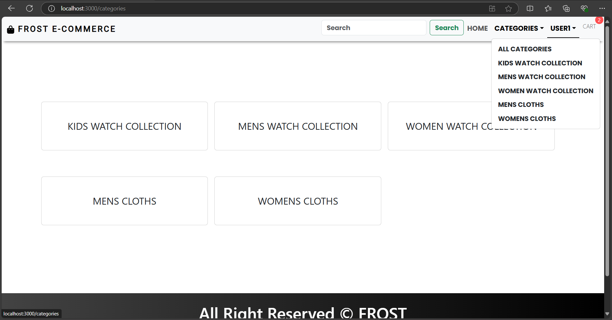
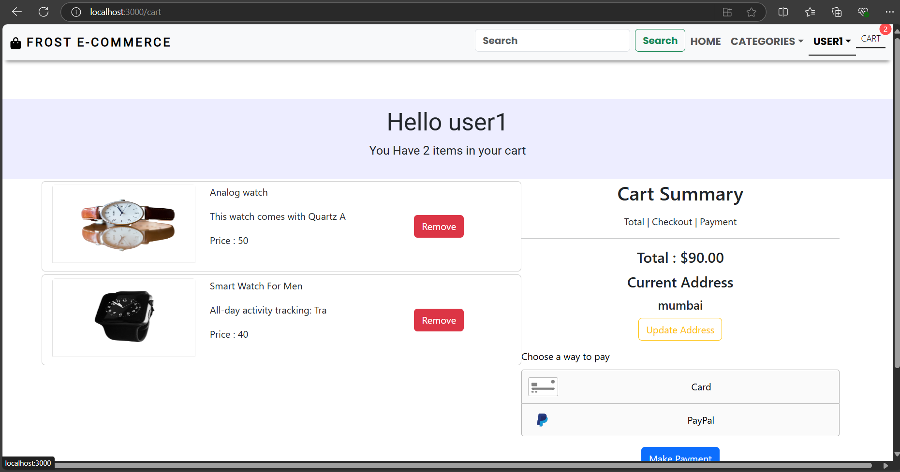
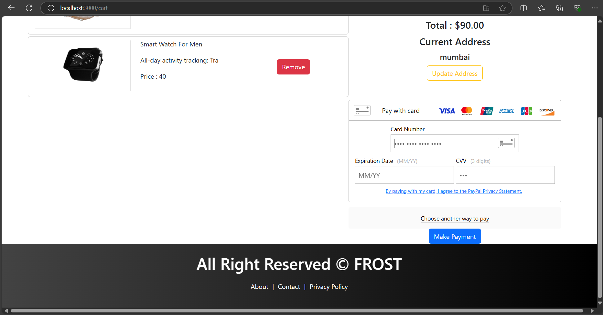
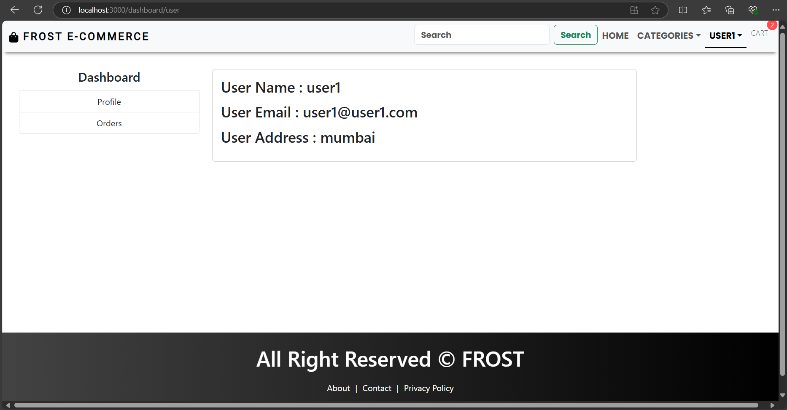
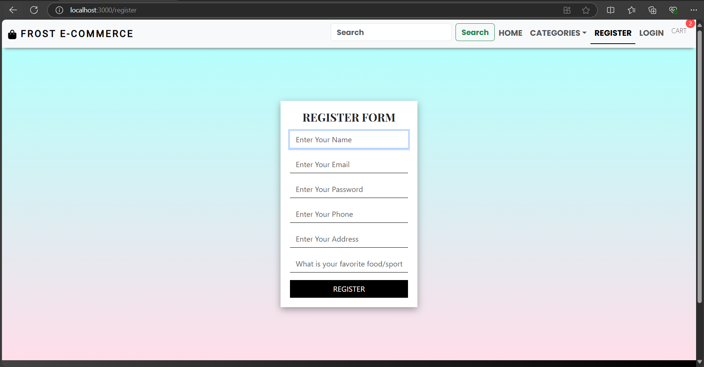
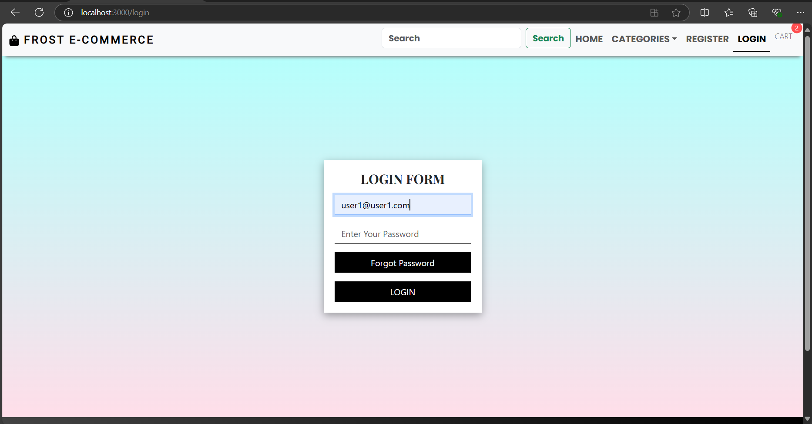

# Frost E-COMMERCE WEBSITE
This e-commerce website is a modern online shopping platform developed using the MERN stack (MongoDB, Express.js, React, Node.js). It offers a user-friendly interface for browsing products, a secure payment gateway, and real-time order tracking. Admins have full control to add, edit, and delete products and categories, ensuring the catalog is always up-to-date. The website is fully responsive, providing an accessible shopping experience across all devices.

## 💫 Home Page

## 💫 Category Page

## 💫 Cart Page

## 💫 Dashboard Page

## 💫 Register Page

## 💫 Login Page

